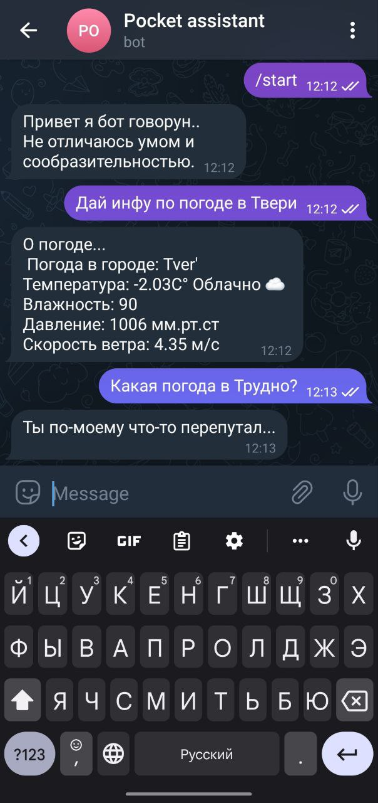

# Pocket assistant-telegram-bot
Телеграмм-бот, умеющий поддержать беседу, рассказывающий о погоде, советующий фильмы и умеет переводить текст с русского на английский и наоборот.
Написан на python с техниками NLP.

Для получения фильма по запросу используется
[Kinopoisk API по рейтингу "7-9", и годам "2018-2022"](https://kinopoisk.dev/).  
Для получения прогноза погоды используется [Open Weather API](https://openweathermap.org/current).  
Для перевода текста использовалась обученные модели [Facebook FAIR's WMT19](https://aclanthology.org/W19-5333/)(https://huggingface.co/facebook/wmt19-en-ru, https://huggingface.co/facebook/wmt19-en-ru).  
Для обучения диалоговой части через FastText были использованы собранные "Otvety.txt" от mail.ru

## Навигация
- [Что умеет бот](#что-умеет-бот)
- [Используемые библиотеки](#используемые-библиотеки)
- [Запуск бота](#запуск-бота)
- [Полезные ссылочки с tutorial по написанию бота](#полезные-ссылки-с-tutorial-по-написанию-бота)

## Что умеет бот:
- Умеет говорить погоду в ЛЮБОМ городе мира (за исключением каких-то мелких городов, о которых не знает API open weather).
- Бот умеет извлекать названия городов и приводить их названия в начальную форму (чтобы потом получить координаты данного города).   

- На основе извлеченного названия города бот умеет давать прогноз погоды на текущую дату и время.
- Бот умеет реагировать на непонятные высказывания. 
    
- Бот может посоветовать фильм из последних новинок с переходом на источник.   

- Бот умеет по запросу от пользователя перевести текст с русского языка на английский и наоборот.   

- Бот может поддержать диалог на различные темы, иногда с юмором :)   

- Бот умеет прощаться.

## Используемые библиотеки
Перед запуском проекта необходимо установить следующие пакеты из файла `TXT/requirements.txt`.

## Запуск бота
0. Иметь установленный python версии >= 3.8

1. Загрузи все используемые библиотеки командой:  
`pip install -r TXT/requirements.txt`
  
2. В файле `config.py` нужно задать токены для работы с апишками.    
**Список всех констант-токенов, которые нужно задать:**
    + в константе `TG_TOKEN` подставь токен своего бота (как создать бота и получить токен [можно почитать здесь](https://vc.ru/dev/156853-telegram-bot-dlya-polucheniya-adresa-po-lokacii-ili-koordinatam-python))
    + в константе `kp_token` подставь токен для [Kinopoisk API](https://kinopoisk.dev/).  
    + в константе `open_weather_token` подставь токен для [Open Weather API](https://openweathermap.org/api).  

3. Добавить модели в папку `NLP` обучить модели можно запустив скрипт `model_training.ipynb`, либо взять готовые с источника [rusvectores.org](https://rusvectores.org/ru/models/)  
4. Запусти скрипт в корне репозитория `asyncbot.py`

## Полезные ссылки с tutorial по написанию бота
- [Aiogram’s documentation](https://docs.aiogram.dev/en/latest/)
- [Telegram-бот через aiogram](https://mastergroosha.github.io/aiogram-3-guide/quickstart/)
- [Как использовать модели с платформы Hugging Face](https://habr.com/ru/post/704592/)
- [Туториал по библиотеки Gensim](https://pythonru.com/biblioteki/gensim)
- [Как отправлять смайлики через telegram bot](https://github.com/python-telegram-bot/python-telegram-bot/wiki/Emoji)
и [emoji cheat sheet](https://www.webfx.com/tools/emoji-cheat-sheet/)
- [How to Convert Video Files to a Gif in Python](https://www.freecodecamp.org/news/how-to-convert-video-files-to-gif-in-python/)
